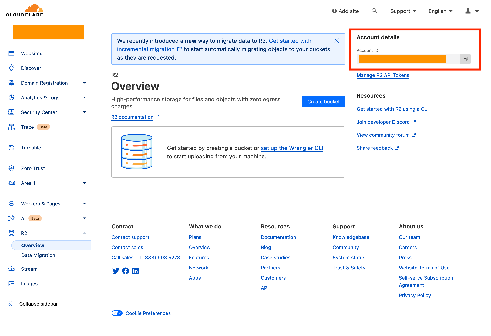
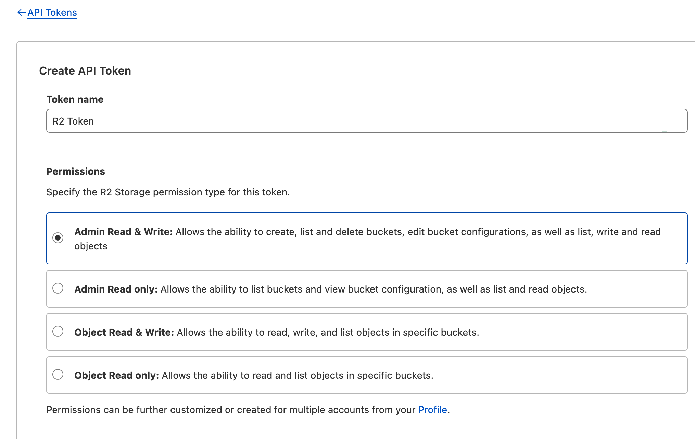

# CloudFlare R2を使って公開のmavenリポジトリを作る(Gradle)

Gradleには標準でS3やCloud Storageをmavenリポジトリとして扱う機能がついているのですが、Google Cloudのライブラリが古すぎて認証に一部問題があるようです。
GitHubからOIDCを使って接続しようと思ったら古いライブラリを使っているせいで認証できませんでした。

ということでCloudFlare R2をmavenリポジトリとして運用していきます。

# CloudFlare R2とは

https://www.cloudflare.com/ja-jp/developer-platform/r2/

CloudFlareの公開しているS3互換のあるオブジェクトストレージです。
S3などと比べて無料枠が大きく、比較的コストの低いストレージになります。
S3互換であるため既存のAWS SDKから操作ができます。R2専用のライブラリを使用しなくてもよい部分も魅力的です。
課金は使用したストレージ容量と書き込みアクセス、読み取りアクセスの回数でなされます。

https://developers.cloudflare.com/r2/pricing/

# 環境

* Java 17
* Gradle 8.4
* Terraform v1.6.4

# 事前準備

CloudFlareのアカウントを用意し、課金の設定をしてください。
無料枠の範囲内で使用していれば課金されることはありませんが、R2を使用するためには設定が必要です。

# R2 Bucketの作成

## Account IDとTokenの確認
まずR2にBucketを作成するためのAccount IDの確認とTokenの作成をします。
R2のページにアクセスして右側にAccount IDがあるのでメモしておきます。

その下にあるManage R2 API TokenからTokenの作成ができます。
Create Tokenと進み、以下のようにAdmin Read & Writeを選択して権限設定を行います。

他の設定項目はそのままで進めます。
次の画面に進むとTokenが作成されます。
またその下にAccess KeyとSecret Keyも表示されます。
このキーはS3クライアントからアクセスするために使用できます。

:::note warn
TokenやAccess Keyなどはこの画面でしか確認できないため、忘れずにメモしてください
:::

今回はこのAccess KeyとSecret KeyでGradleからアップロードします。

## Bucketの作成

BucketはTerraformで作ります。
```terraform
terraform {
  required_providers {
    cloudflare = {
      source = "cloudflare/cloudflare"
      version = "~> 4"
    }
  }
}

provider "cloudflare" {
  api_token = var.cloudflare_token
}

resource "cloudflare_r2_bucket" "cloudflare-bucket" {
  account_id = var.cloudflare_account
  name       = var.bucket_name
  # See https://developers.cloudflare.com/r2/reference/data-location for location
  # location   = "apac"
}
```

`api_token` と `account_id` は上で確認したものを入れてください。
bucketの名前は適当なものを設定してください。
locationは5箇所ほど用意されているようです。
何も入力しないと近い地域のリージョンが選ばれます。
GDPRなど地理的な制限がある場合は指定する必要があるかなと思います。

Applyすれば作成されます。

# Gradleの設定

## 準備

認証情報として使うのでR2のAccess KeyとSecret Keyを用意してください。
Tokenの作成をすると一緒に表示されます。

## `build.gradle.kts` の設定

`maven-publish` プラグインを設定し、以下のようにpublishの設定をしました。

```
publishing {
    publications {
        create("mavenJava", MavenPublication::class) {
            from(components.named("java").get())
        }
    }
    repositories {
        val bucketName = project.findProperty("r2_bucket_name") ?: System.getenv("R2_BUCKET_NAME") ?: ""
        maven {
            name = "R2"
            url = uri("s3://${bucketName}")
            credentials(AwsCredentials::class) {
                accessKey = (project.findProperty("r2_access_key") as String?) ?: System.getenv("R2_ACCESS_KEY") ?: ""
                secretKey = (project.findProperty("r2_secret_key") as String?) ?: System.getenv("R2_SECRET_KEY") ?: ""
            }
        }
    }
}
```
